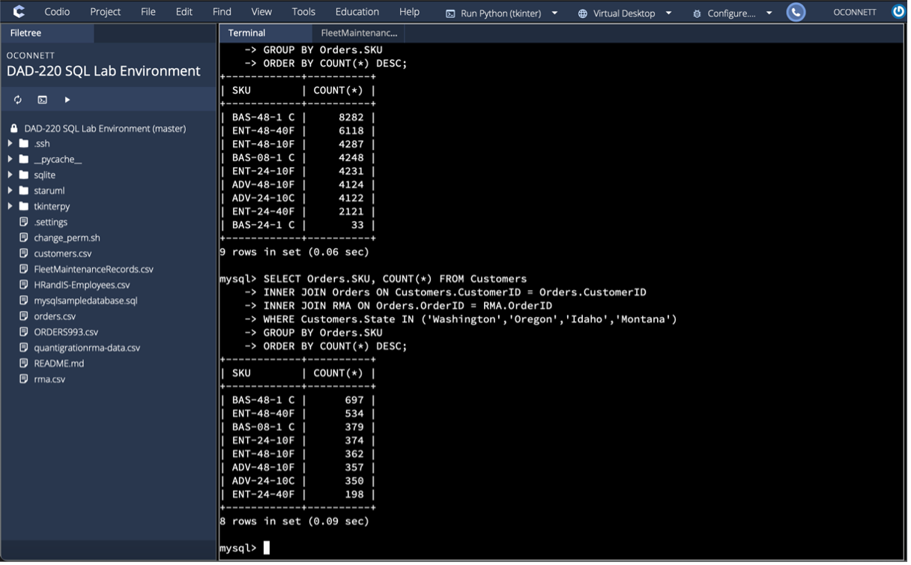

# DAD-220-Quantigration-SQL-Major-Activity

**_Summary_**

This assignment dealt with SQL databases files of a company named Quantigration RMA. The company wanted to know more information regarding order quantites by product SKU, returns by product SKU or by region, and largest customerbase locations. The assignemnt used SQL queries to return back key information for answering questions provided by the company. An example screenshot below displays the SQL query for retrieving the top product SKUs returned in the Northwest region (Washington, Oregon, Idaho, Montana). 

